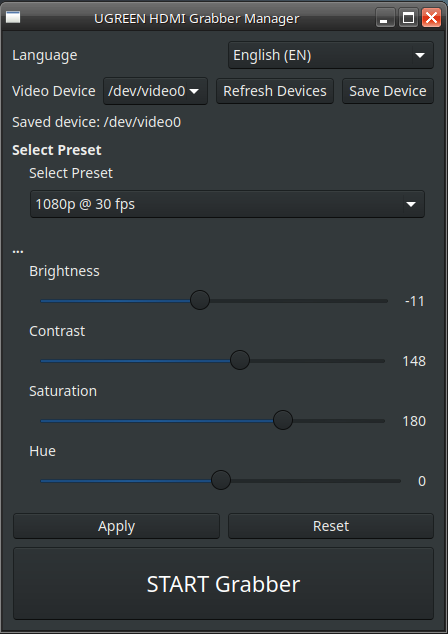

# HDMI Grabber Manager (UGREEN) – Linux MX

> **Language:** [English](#english) | [Polski](#polski)

---

## <a name="english"></a>English (default)

**HDMI Grabber Manager (UGREEN)** is a professional GUI application for controlling UGREEN HDMI USB grabbers on Linux using **V4L2** and **ffplay**.  
It supports brightness/contrast controls, resolution presets, live preview, device selection, and remembers last settings.

### ✨ Features

* 🎥 Live HDMI preview (**MJPEG low-latency**) via ffplay
* 🎛 Adjust brightness, contrast, saturation, and hue (v4l2-ctl)
* 📺 Resolution & FPS presets (720p / 1080p @ 30/60fps)
* 🔌 Video device selection (`/dev/video*`)
* 💾 Saves last used device, language, and controls
* 🌍 English & Polish interface
* 📦 Easy installation via **.deb** or `install.sh`

### 🐧 Supported Systems

* MX Linux
* Debian-based distributions (Ubuntu, Mint, etc.)

### 📦 Installation Methods

#### 1️⃣ Using .deb Package (from repo)

```bash
# Clone repo
git clone https://github.com/hattimon/hdmi-grabber-manager.git
cd hdmi-grabber-manager

# Build and install .deb
chmod +x install.sh
sudo ./install.sh  # choose option 1 to create .deb, option 2 to install

# Alternatively, if .deb already exists
sudo dpkg -i hdmi-grabber-manager_3.0.0_all.deb
sudo apt -f install  # fix dependencies if needed
```

#### 2️⃣ Using install.sh Script Directly

```bash
chmod +x install.sh
sudo ./install.sh
```

Choose:

* `1` Create .deb package
* `2` Install from .deb
* `3` Uninstall application

#### 3️⃣ Uninstallation

```bash
sudo ./install.sh  # choose option 3
```

Or remove manually:

```bash
sudo rm -rf /opt/hdmi-grabber-manager
sudo rm -f /usr/local/bin/hdmi-grabber-manager
sudo rm -f /usr/share/applications/hdmi-grabber-manager.desktop
```

### 🚀 Running the App

* From menu: `Menu → Multimedia → HDMI Grabber Manager`
* From terminal: `hdmi-grabber-manager`

### 🎛 Controls

| Control    | Description                |
| ---------- | -------------------------- |
| Brightness | Adjust brightness          |
| Contrast   | Adjust contrast            |
| Saturation | Adjust color intensity     |
| Hue        | Adjust color tone          |
| Presets    | Choose resolution and FPS  |
| Device     | Select HDMI capture device |

### 📷 Screenshots



**Author:** HDMI Grabber Manager Project created by HATTIMON  
Optimized for UGREEN HDMI Capture cards  
**License:** Free for private and educational use  

---

## <a name="polski"></a>Polski

**HDMI Grabber Manager (UGREEN)** to profesjonalna aplikacja GUI do sterowania UGREEN HDMI USB grabberami na Linuxie przy użyciu **V4L2** i **ffplay**.  
Obsługuje jasność/kontrast, presety rozdzielczości, podgląd na żywo, wybór urządzenia i pamięta ostatnie ustawienia.

### ✨ Funkcje

* 🎥 Podgląd HDMI na żywo (**MJPEG niskie opóźnienie**) przez ffplay
* 🎛 Regulacja jasności, kontrastu, nasycenia i barwy (v4l2-ctl)
* 📺 Presety rozdzielczości i FPS (720p / 1080p @ 30/60fps)
* 🔌 Wybór urządzenia wideo (`/dev/video*`)
* 💾 Zapamiętuje ostatnie urządzenie, język i ustawienia
* 🌍 Interfejs po angielsku i polsku
* 📦 Łatwa instalacja przez **.deb** lub `install.sh`

### 🐧 Obsługiwane systemy

* MX Linux
* Dystrybucje oparte na Debianie (Ubuntu, Mint, itp.)

### 📦 Metody instalacji

#### 1️⃣ Instalacja z paczki .deb (z repo)

```bash
# Sklonuj repozytorium
git clone https://github.com/hattimon/hdmi-grabber-manager.git
cd hdmi-grabber-manager

# Utwórz i zainstaluj .deb
chmod +x install.sh
sudo ./install.sh  # wybierz opcję 1 aby utworzyć .deb, opcję 2 aby zainstalować

# Alternatywnie, jeśli .deb istnieje
sudo dpkg -i hdmi-grabber-manager_3.0.0_all.deb
sudo apt -f install  # napraw zależności jeśli trzeba
```

#### 2️⃣ Instalacja bezpośrednio ze skryptu install.sh

```bash
chmod +x install.sh
sudo ./install.sh
```

Wybierz:

* `1` Utwórz paczkę .deb
* `2` Zainstaluj z .deb
* `3` Odinstaluj aplikację

#### 3️⃣ Odinstalowanie

```bash
sudo ./install.sh  # wybierz opcję 3
```

Lub ręcznie:

```bash
sudo rm -rf /opt/hdmi-grabber-manager
sudo rm -f /usr/local/bin/hdmi-grabber-manager
sudo rm -f /usr/share/applications/hdmi-grabber-manager.desktop
```

### 🚀 Uruchamianie aplikacji

* Z menu: `Menu → Multimedia → HDMI Grabber Manager`
* Z terminala: `hdmi-grabber-manager`

### 🎛 Sterowanie

| Kontrola   | Opis                       |
| ---------- | -------------------------- |
| Jasność    | Regulacja jasności         |
| Kontrast   | Regulacja kontrastu        |
| Nasycenie  | Intensywność kolorów       |
| Barwa      | Odcień kolorów             |
| Presety    | Wybór rozdzielczości i FPS |
| Urządzenie | Wybór urządzenia HDMI      |

### 📷 Zrzuty ekranu


---

**Autor:** HDMI Grabber Manager Project stworzony przez HATTIMON  
Optymalizacja dla kart UGREEN HDMI Capture  
**Licencja:** Darmowe do użytku prywatnego i edukacyjnego  
